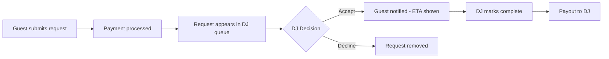

# 🎧 DJ Request Platform

A modern, real-time song request management platform for DJs. Accept song requests from your audience with integrated payments, manage your queue, and maximize your earnings at every event.

[](https://reactjs.org/)
[](https://vitejs.dev/)
[](https://tailwindcss.com/)
[](https://supabase.com/)
[](https://stripe.com/)

## ✨ Features

### For DJs
- 🎵 **Event Management** - Start/stop events with venue tracking
- 📱 **QR Code Generation** - Unique QR codes for easy request access
- 💰 **Real-time Earnings** - Track revenue as requests come in
- ⚡ **Live Request Queue** - Accept, decline, or complete requests instantly
- 📊 **Financial Dashboard** - View daily and all-time earnings
- ⏱️ **ETA Management** - Set estimated play times for accepted requests
- 🔔 **Real-time Updates** - Instant notifications when new requests arrive

### For Audience
- 🎤 **Tiered Requests** - Choose from song-only, with greeting, or with photo
- 💳 **Secure Payments** - Stripe-powered payment processing
- 💬 **Personal Messages** - Add dedications and shoutouts
- 📸 **Photo Uploads** - Include images with premium requests
- 💵 **Tipping System** - Add tips to support your favorite DJ
- 📧 **Email Receipts** - Automatic payment confirmations

## 🚀 Tech Stack

### Frontend
- **React 18** - Modern UI with hooks
- **Vite** - Lightning-fast development and build tool
- **Tailwind CSS** - Utility-first styling
- **Zustand** - Lightweight state management
- **React Router** - Client-side routing
- **React Hot Toast** - Beautiful notifications

### Backend & Services
- **Supabase** - Authentication and real-time database
- **Stripe** - Payment processing and payouts
- **Axios** - HTTP client with interceptors

### Development
- **ESLint** - Code linting
- **PostCSS** - CSS processing
- **dayjs** - Date/time manipulation

## 📁 Project Structure

```text
DJ-FRONTEND/
├── src/
│   ├── api/                    # API layer (MVP pattern)
│   │   ├── config/
│   │   │   ├── axiosInstance.js
│   │   │   └── endpoints.js
│   │   ├── services/
│   │   │   ├── auth.service.js
│   │   │   ├── dj.service.js
│   │   │   ├── events.service.js
│   │   │   ├── requests.service.js
│   │   │   └── finances.service.js
│   │   └── index.js
│   ├── components/            # Reusable components
│   │   ├── GuardedRoute.jsx
│   │   ├── Layout.jsx
│   │   └── Toast.jsx
│   ├── hooks/                 # Custom React hooks
│   │   └── useRealtimeRequests.js
│   ├── lib/                   # Core utilities
│   │   ├── api.js
│   │   ├── auth.js
│   │   ├── stripe.js
│   │   └── supabase.js
│   ├── pages/                 # Route pages
│   │   ├── Dashboard.jsx
│   │   ├── Events.jsx
│   │   ├── Finances.jsx
│   │   ├── Settings.jsx
│   │   ├── Login.jsx
│   │   ├── Signup.jsx
│   │   ├── DjRouter.jsx
│   │   └── PublicRequest.jsx
│   ├── store/                 # Zustand stores
│   │   ├── useAuthStore.js
│   │   └── useEventStore.js
│   ├── utils/                 # Helper functions
│   │   ├── format.js
│   │   ├── money.js
│   │   └── validators.js
│   ├── App.jsx
│   └── main.jsx
├── public/
├── .env.example
├── package.json
├── vite.config.js
└── tailwind.config.js
```

## 🛠️ Getting Started

### Prerequisites

- Node.js 18+ and npm
- Supabase account
- Stripe account

### Installation

1. **Clone the repository**
   ```bash
   git clone https://github.com/yourusername/dj-frontend.git
   cd dj-frontend
   ```

2. **Install dependencies**
   ```bash
   npm install
   ```

3. **Set up environment variables**

   Create a `.env` file in the root directory:

   ```env
   # Supabase
   VITE_SUPABASE_URL=your_supabase_project_url
   VITE_SUPABASE_ANON_KEY=your_supabase_anon_key

   # API
   VITE_API_URL=http://localhost:3001

   # Stripe
   VITE_STRIPE_PUBLISHABLE_KEY=your_stripe_publishable_key
   ```

4. **Start the development server**
   ```bash
   npm run dev
   ```

5. **Open your browser**
   ```
   http://localhost:5173
   ```

### Build for Production

```bash
npm run build
```

Preview production build:
```bash
npm run preview
```

## 🔐 Environment Variables

| Variable | Description | Required |
|----------|-------------|----------|
| `VITE_SUPABASE_URL` | Your Supabase project URL | ✅ |
| `VITE_SUPABASE_ANON_KEY` | Supabase anonymous key | ✅ |
| `VITE_API_URL` | Backend API URL | ✅ |
| `VITE_STRIPE_PUBLISHABLE_KEY` | Stripe publishable key | ✅ |

## 📖 Usage

### For DJs

1. **Sign up** and create your DJ account
2. **Complete Stripe onboarding** in Settings to receive payments
3. **Start an event** from the Events page
4. **Share your QR code** or link with your audience
5. **Manage requests** from your Dashboard
6. **Track earnings** in the Finances section

### For Guests

1. **Scan the DJ's QR code** or visit their unique link
2. **Choose a request tier** (song, song + greeting, song + greeting + photo)
3. **Add your song** and optional message/photo
4. **Add a tip** (optional)
5. **Complete payment** securely via Stripe
6. **Wait for confirmation** - you'll see when your song is accepted!

## 🏗️ Architecture

### API Layer (MVP Pattern)

The project follows a clean MVP (Model-View-Presenter) architecture:

- **Config** - Axios instance with auth interceptors and centralized endpoints
- **Services** - Business logic layer with clean, reusable service classes
- **Stores** - Zustand state management for global state
- **Pages** - React components for routing

#### Service Example

```javascript
import { djService, eventsService } from '../api';

// Get DJ profile
const profile = await djService.getDjProfile();

// Start an event
const event = await eventsService.startEvent({
  venue_name: 'Blue Note Jazz Club'
});

// Get pending requests
const requests = await requestsService.getPendingRequests();
```

### Real-time Features

Uses Supabase real-time subscriptions for instant updates:
- New request notifications
- Request status changes
- Live revenue tracking

### Authentication

- Supabase Auth with JWT tokens
- Automatic token refresh
- Session caching for performance
- Protected routes with auth guards

## 🎨 Key Features Explained

### Request Tiers

| Tier | Price | Includes |
|------|-------|----------|
| Song Request | $5.00 | Song request only |
| Song + Greeting | $10.00 | Song + personal message |
| Song + Greeting + Photo | $15.00 | Song + message + photo upload |

### Request Workflow



## 🚧 Roadmap

- [ ] Analytics dashboard with charts
- [ ] Playlist integration (Spotify, Apple Music)
- [ ] Multiple currency support
- [ ] Mobile app (React Native)
- [ ] Social media sharing
- [ ] Request history for guests
- [ ] Automated request suggestions
- [ ] Multi-language support

## 🤝 Contributing

Contributions are welcome! Please feel free to submit a Pull Request.

1. Fork the project
2. Create your feature branch (`git checkout -b feature/AmazingFeature`)
3. Commit your changes (`git commit -m 'Add some AmazingFeature'`)
4. Push to the branch (`git push origin feature/AmazingFeature`)
5. Open a Pull Request

### Development Guidelines

- Follow the existing code style
- Use meaningful commit messages
- Add tests for new features
- Update documentation as needed
- Ensure all lints pass: `npm run lint`

## 📝 License

This project is licensed under the MIT License - see the [LICENSE](LICENSE) file for details.

## 🙏 Acknowledgments

- Built with [React](https://reactjs.org/)
- Styled with [Tailwind CSS](https://tailwindcss.com/)
- Powered by [Supabase](https://supabase.com/)
- Payments via [Stripe](https://stripe.com/)

## 📧 Contact

**Eduardo Brito** - [GitHub](https://github.com/yourusername)

Project Link: [https://github.com/yourusername/dj-frontend](https://github.com/yourusername/dj-frontend)

---

<div align="center">
Made with ❤️ for DJs and music lovers everywhere 🎵
</div>
